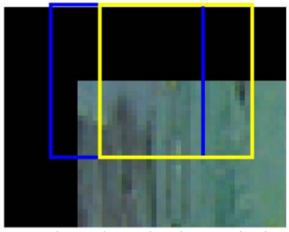
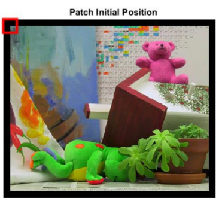
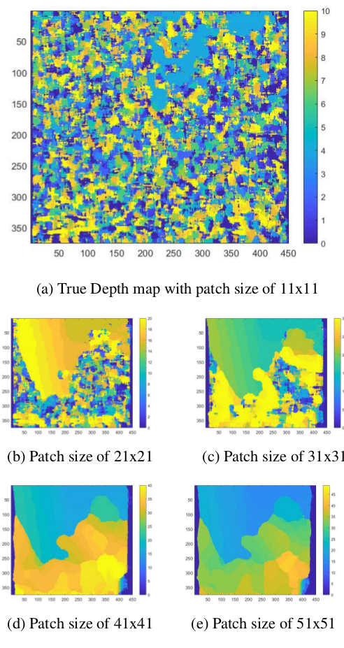
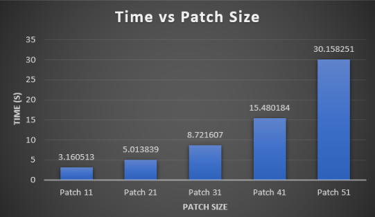

# Binocular Stereo Vision

## Setting up the enviroment:
For this project the following set up was used:
- Matlab 9.5 	R2018b

## Installation steps:
- Run the code in the ```Matlab``` software.

## Project Description
### Abstract
Dense correspondence and disparity maps are known topics in Computer Vision due to the variety of applications. This report presents an approach to fill up the **horizontal disparity**, assuming all images are rectified, combining **gradient-based features** with **path matching** to generate a **disparity map**. 

The algorithm is composed of four steps: increase the size of the images, apply gradient-based features, compare the images using the path matching, and use the normalized correlation to identify the best correspondence matching 

### Introduction
There are multiple dense correspondence matching methods, such as: **Basic stereo matching (pixel by pixel), Histograms of oriented gradients, Dynamic programming, graphs**. For this experiment, the **Patching matching** method was used to test its efficiency. This method creates a patch of any size for each image, then a comparison takes place between one patch from the left_image and K patches from the image_right. As shown in **Figure 1**:

<p align="center">
  
</p>

<p align="center">
  <b> Figure 1: </b> Patches Matching.
</p>

The previous patch matching is a pixel to pixel comparison. For a more accurate comparison the **gradient-based features** is used, this method calculates the gradient magnitude and the gradient direction of the image, making the object features more detailed against the pixeil to pixel approach. Therefore, the **patch matching** comparison will be more precised.

### Methology
Assuming 2 rectified images (image left and image right). Determine the image size of both of them before setting the patch size, the patch size depends on the image resolution **(higher the resolution greater the patch size)**. Aditionally, the **patch size** must be **odd and equal on sides**, the reason is to locate the center of it in the position of the desired pixel to be analyzed. Then two additional matrices are created and each of them with bigger dimensions than the original images, this is to avoid ’ifstatements’ inside the loop iterations and optimize the speed performance of the code.

Apply the **Gradients-Based Features** approach to extract useful information of both images. Once the gradients magnitude and the direction of the bigger images are obtained, patches will be located at the first pixel of the image (which is inside the bigger image) in both images. As shown in following image:

<p align="center">
  
</p>

<p align="center">
  <b> Figure 2: </b> Initial position of the patch located in the new image.
</p>

For every patch of the right image, there will be **2 times the patch offset comparisons** with different patches from the left image. These similarities will be scored using the matching process **Normalised Correlation**, and only the best result will be taken into account. The final step is to determine the column position of the best score and subtract it to the current column position of the right image. The result is the **disparity map** generation.

### Experiment
The disparity map was calculated with **different patch sizes**, the results shown bellow were made in a 375x450 image dimension. 

<p align="center">
  
</p>

<p align="center">
  <b> Figure 3: </b> If the patch size is too small then the disparity map will not be too accurate to calculate the matching
between the images, it only takes a few values to performed the Normalised Correlation and therefore it reduces the execution
time. On the other hand, if we increase the patch size too much there will be many calculations involved leading to an increase in the execution time and also the patch will tend to be more similar because they cover a bigger area of the image.
</p>


Additionally, the times of the were proportional to the patch size as shown in the following graph. However, there is a intermediate patch size which has the best output and time, in this case it is the 31x31 patch size for 375x450 input images.

<p align="center">
  
</p>

<p align="center">
  <b> Figure 4: </b> This graph represent the different execution time vs patch sizes. Each of them is a result of the
  mean values of 10 executions.
</p>

### Conclusion
In this report, I have presented the disparity map calculation using **gradients-based features**, **path mathcing**,and **Normalised Correlation** for matching. As shown in the previous section, this did not result in a high performance algorithm not even in accuracy nor execution time. The cases are: uniform regions always match, path size is fixed across the image but viewed objects differ in size and depth , dense disparity is computationally expensive in spatial domain. However, there is an option to optimize the algorithm by applying convolution.
